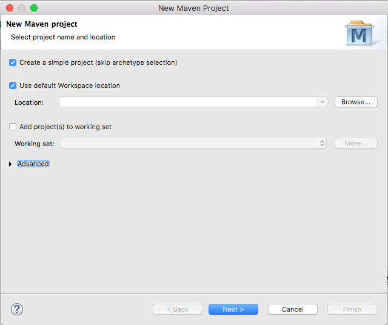
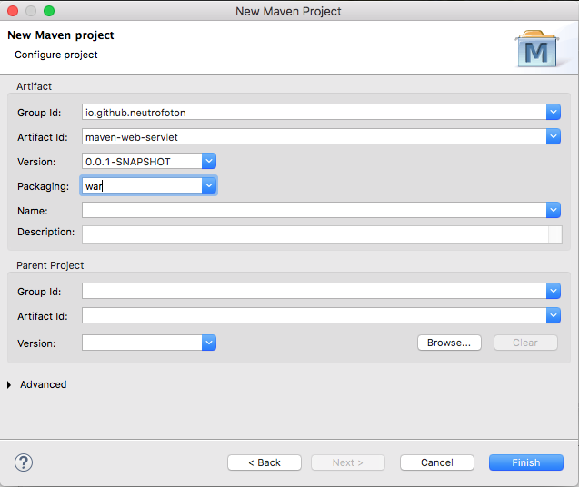
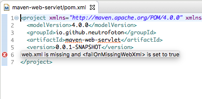

# maven-web-servlet


### Step 1 : Create Maven Project


### Step 2 : In New Maven Project wizard, select Create a simple project and click on Next


### Step 3 :


### Step 4 : Open generated pom.xml, it will get error warning. 


### Step 5 : Edit pom.xml, add servlet dependency and Tomcat maven plugin


Then update web maven project, right click on maven-web-project-example project -> Maven -> Update Project


### Step 6 : Add servlet class

### Step 7 : open terminal, run command

``` bash
$ mvn clean install
```

### Step 8 : run command

``` bash
$ mvn tomcat7:run
```


### Step 9 : Open in browser ,  http://localhost:8080/hello


## References :
1. https://www.boraji.com/how-to-create-a-web-project-using-maven-in-eclipse